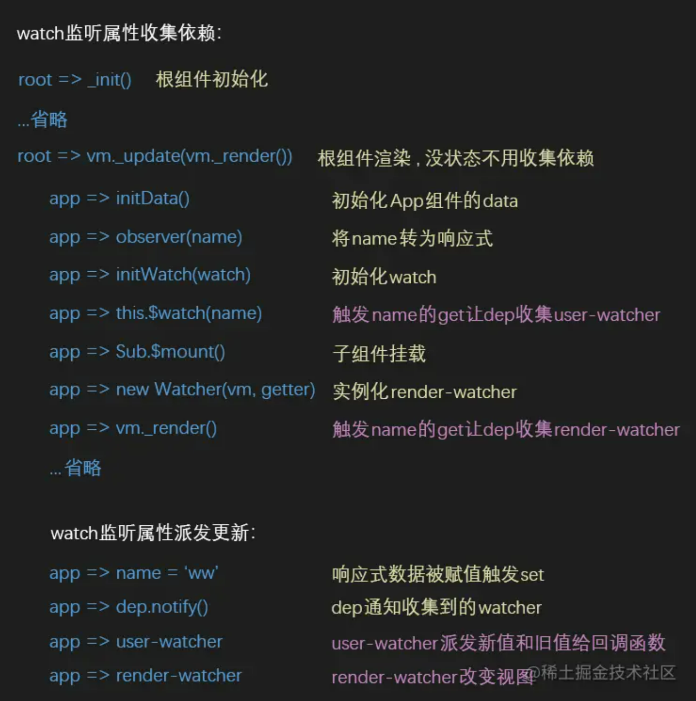

# 面试笔记（一）

## 字节跳动

- 自我介绍

- 介绍项目

- 浏览器输入一个URL到页面渲染发生了什么，详细说说

- 页面中的JS需要提前加载，不阻塞页面渲染，怎么做

- 浏览器缓存机制。强缓存、协商缓存的标识。

  - 强缓存：Expires、Cache-control。缓存数据库中有数据，且没有过期，就直接从缓存数据库中取，不请求服务器，有数据但是缓存失效，就请求服务器，服务器返回数据和缓存规则，将数据和缓存规则存入缓存数据库中
  - 协商缓存：Etag/If-None-Match；If-Modify-Since/Last-Modified。从缓存数据库中获取缓存规则，请求服务器验证是否失效，没有失效则返回304，直接从缓存中读取数据，失效的话就会返回新的数据和缓存规则， 并存入缓存数据库中。
  - network中的size这个选项，可以看到来源信息

- CSS盒模型由几种。怎么去设置盒模型

- 如何实现一个元素的水平垂直方向上的居中

- 对象和数组，如何区分哪个是对象哪个是数组

- 改变this指向的方法

- v-for循环展示列表，要加上key。可以用index当作key吗

  - 需要增、删的场景不可以使用key

- vue的diff中，key的作用是什么

  - 在vue中，判断节点是否可复用，都是以key值作为判断的前提条件，如果不使用key值，就会默认更新所有节点。
  - key是Vue中虚拟dom的唯一标记，通过这个key，我们的diff操作可以更加的准确和快速
    - 更准确：用了key之后，就不是简单的就地复用。key会作为比较前后两个节点是不是一个节点的依据
    - 利用key的唯一性生成map对象来获取对应节点，比遍历的方式更快

- vue的响应式是怎么实现的

  - **observer对象**：用来对象数据对象进行遍历，使用了Object.defineProperty这个API，给对象的属性都加上getter和setter的拦截
  - **compiler解析器**：用来编译模板、解析vue里面的指令，会将模板里面的变量都替换成数据，然后渲染页面，并且会给每一个指令对应的节点绑定一个更新函数，并添加监听数据的订阅者，一旦数据发生变化，就会收到通知调用更新函数进行数据更新
  - **Dep订阅器**：采用发布订阅模式，用来收集Watcher，对Observer和Watcher进行统一管理
  - **Watcher订阅者**：是Observer和Compiler之间通信的桥梁，主要的任务是订阅observer中属性值变化的消息，当收到属性值变化的消息，触发compiler解析器中对应的更新函数

- vue-router两种模式的区别

- history模式，需要服务端怎么配合

  - 之所以刷新页面白屏，其实是因为路由找不到对应的资源，就会404，为了避免这种情况的发生，可以让所有的路由都指向index.html

  - **前端方面的配置**：

    - 首先要设置路由的mode和base两个值

      - ```js
        const routes = [];
        const router = new VueRouter({
            mode: 'history',
            base: process.env.BASE_URL,
            routes
        })
        ```

    - 其次要设置vue.config.js里面的publicPath

      - ```js
        module.exports = {
            /**
            publicPath默认值是 '/'，即你的应用是被部署在一个域名的跟路径上，
            设置为 ./  可以避免打包后的静态页面空白
            当在非本地环境时，这里以项目test-daily为例，即打包后的后h5项目部署在服务器的test-daily目录下，那么这里就要把publicPath设置为  /test-daily/，表示所有的静态资源都在 /test-daily/里
            打包部署后，会发现index.html引用的静态资源都添加了路径 /test-daily/
            **/
            
          	publicPath: process.env.NODE_ENV == 'development' ? './' : '/test-daily/',
        }
        ```

- 页面性能，performance会关注吗

- 看输出

- 算法题


## 汤臣倍健

- 自我介绍

- 介绍项目

- 一个新的项目，如何进行技术选型、技术调研

- CSS选择器

  - 基础选择器
    - id
    - class
    - 标签
    - 通配符
  - 属性选择器
  - 伪类选择器
  - 伪元素选择器
  - 组合选择器

- CSS选择器的优先级

  - id > class 、属性、伪类> 标签、伪元素 > 通配符

- 基本数据类型和引用数据类型的区别

- get和post的区别，本质上由区别吗
  
  - 本质上没有区别。
  
- vuex有哪些属性

- 如何实现一个水平垂直方向上的居中

- rem是什么

  - rem的值是px的倍数

- vue中的diff是怎么做的

- vue的diff是深度优先还是广度优先
  
  - 深度优先
  
- vue-router的两种路由模式有什么区别

- 箭头函数和普通函数区别

- call、apply、bind的区别

- 浏览器发送一个http请求的过程中发生了什么

- 简单说一下原型链
  - 当访问一个对象的属性时，如果这个对象本身不存在这个属性，就会去它的构造函数的`prototype`属性中寻找上查找，依次类推
  - 对象都有一个`__proto__`属性
  - 函数都有一个`prototype`属性
  
- cookie、sessionStorage、localStorage有什么区别

- http-only属性是做什么的

- 闭包

- 浏览器的同源策略。解决跨域的方法有哪些

- 如何实现深拷贝

- HTTPS和HTTP有什么区别
  - HTTPS：以安全为目标，是具有安全性的SSL加密传输协议，端口是443
  - HTTP：超文本传输协议，信息是明文传输，端口是80
  
- 多端自适应-媒体查询：CSS3的 @media

  - ```css
    @media mediaType and|not|only (media feature) {
        /* CSS-Code */
    }
    ```

  - mediaType：

    - all：所有屏幕
    - screen：电脑屏幕，平板电脑，智能手机
    - print：打印机，打印预览
    - speech：屏幕阅读器等发声设备

  - media feature：媒体功能

    - min-width：页面最大宽度
    - max-width：页面最小宽度

  - ```css
    
    @media (max-width: 1280px) {
      body {
        background: pink;
      }
    }
     
    @media (min-width: 1281px) and (max-width: 1366px) {
      body {
        background: red;
      }
    ```


## 树维信息

- forEach和map的区别
  - map：会创建一个新的数组，其结果是在调用数组中的每个元素上调用提供的函数。不改变原数组。
  - forEach：针对每个元素执行提供的函数。不会返回新数组，不会改变原数组（当数组中的元素是值类型，不会改变数组，当 数组中的元素是引用类型，可以改变数组）
- Vue中虚拟DOM解析的过程
  - 虚拟DOM：
    - 用对象属性来描述节点，实际上它是一层对真实DOM封装。定义了真实DOM的一些关键性的信息，将原本需要在真实DOM上进行的创建节点、添加节点等一系列复杂的DOM操作，全部放到虚拟DOM中执行。将vnode更新的地方用diff算法来更新只修改了的地方，可以避开很多无谓的修改。
  - render函数之后，生成了vnode。
- Vue中key的作用:
  - key会作为diff算法中，比较两个节点是否为同一个节点依据之一。
  - key重复、复用，会造成dom复用的错误

- 一维数组转树形结构

  - ```js
    // 递归方式
    const arrayToTree = function (nums, pId) {
        // 找到有相同父元素的元素（找子元素）
        let flag = nums.filter(item => item.pId === pId) || [];
    
        return flag.length === 0
            ? []
            : flag.map(item => {
                  let obj = { id: item.id, pId: pId, children: arrayToTree(nums, item.id) };
                  return obj.children.length === 0 ? { id: item.id, pId: pId } : obj;
              });
    };
    
    let arr = [
        {
            id: 1,
            pId: null,
            name: '1',
            children: [],
        },
        {
            id: 2,
            pId: 1,
            name: '2',
            children: [],
        },
        {
            id: 3,
            pId: 4,
            name: '3',
            children: [],
        },
        {
            id: 4,
            pId: 1,
            name: '4',
            children: [],
        },
        {
            id: 5,
            pId: 8,
            name: '5',
            children: [],
        },
    ];
    
    console.log(arrayToTree(arr, null));
    ```

  - for循环嵌套，查找外层循环的子元素


## 东方财富

- **v-if、v-show和display:none**

  - v-if：DOM节点直接消失，视觉上看不到，也没有位置，dom节点也不在
  
    - v-show：调用display: none来控制元素是否展示
  
    - display：none：物理空间消失，但是dom还在（视觉上看不到了，也没有位置，但是dom还在）


  - visibility: hidden：物理空间和dom都在，只是视觉上看不到了


  - v-if或者v-show之后，要给某个新展示的元素聚焦，需要将focus用nextTick包裹

- computed和watch

  - computed是计算属性，依赖其他属性值，computed的值是有缓存的，只有它依赖的属性值发生改变，下一次获取computed的值时，才会重新计算computed的值。 ---  需要进行计算，并且依赖于其他数据时，使用computed，利用了computed缓存的特性，避免每次都重新计算
  - watch更多的是观察的作用，类似于某些数据的监听回调，每当监听的数据变化时，都会执行回调。 ---  需要在数据变化时执行异步或者开销较大的操作时，使用watch

- 下标的方式修改数组

  - 通过下标的方式修改数组，不能实现响应式，可以使用`this.$set`、`splice方法`

- vue生命周期：开始创建、初始化数据、编译模板、挂载DOM-->渲染、更新--渲染、卸载等。

  - beforeUpdate：（发生在虚拟DOM打补丁之前）当执行到这个钩子的时候，页面中显示的数据还是旧的，此时data中的数据是新的，只是页面还没有和最新的数据保持同步
  - beforeDestory：Vue进入到了销毁阶段，此时，实例身上的所有data、methods、过滤器、指令等，都处于可用的状态
  - destoryed：实例身上的所有data、methods、过滤器、指令等，都不可用的
  - 
  - ssr中：beforeCreated和created之外的生命周期不能使用（服务端渲染和前端渲染的区别：服务端渲染没有实际的dom结构）

- v-for和v-if的优先级

  vue2中：v-for的优先级比v-if的优先级高

  vue3中：v-if的优先级比v-for的优先级高

- Vue-router导航守卫

  - 全局导航守卫：任何路由跳转都会调用这个钩子函数
    - 前置守卫：`beforeEach(to, from, next) => {}`
    - 解析守卫：`beforeResolve(to, from, next) => {}`，在`beforeRouteEnter`之后调用
    - 后置守卫：`afterEach(to, from) => {}`
  - 路由独享守卫：在路由对象内部的，进入该路由前被调用
    - `beforeEnter(to, from, next) => {}`，在全局前置守卫后面调用，只在进入路由时触发
  - 组件导航守卫：定义在组件内部的
    - 在该组件对应的路由被进入之前调用：`beforeRouteEnter(to, from, next) => {}`，在路由独享守卫后面调用，还不能获取到组件实例`this`，此时组件实例还没有创建
    - 在该组件被复用的时候：`beforeRouteUpdate(to, from, next) => {}`。当前路由改变，但是组件被复用了。比如带有动态参数的路径`/foo/:id`
    - 在该组件对应的路由离开之前调用：`beforeRouteLeave(to, from, next) => {}`，此时还可以访问组件的实例this
  - 导航解析的流程：
    - 导航被触发
    - 失活的组件内触发`beforeRouteLeave`钩子函数，离开当前组件
    - 触发全局导航前置守卫`beforeEach`
    - 若组件复用触发组件守卫`beforeRouteUpdate`
    - 路由配置中的`beforeEnter`
    - 根据路由配置，解析、加载异步路由组件
    - 在被激活的组件中调用`beforeRouteEnter`
    - 调用全局的解析守卫`beforeResolve`
    - 导航被确认
    - 调用全局的后置守卫`afterEach`

- 项目中用到的vue-router导航钩子

  - `beforeEach`：每一个路由切换都会触发这个钩子
    - 1、改变浏览器标签页的名称：`document.title = getPageTitle(to.meta.title)`，getPageTitle中可以做一些非空判断的处理
    - 2、根据token判断有没有登录，没有登录则跳转到登录页。跳转使用`next({ 路由 })`
    - 开始展示页面加载的进度条
  - `afterEach`：结束页面加载的进度条

- vue-router数据传递

  - 动态路由匹配：

    - ```js
      const routes = [
          { path: '/users/:id', component: User }
      ]
      
      `users/12345`会匹配到这个路由
      
      params: {
          id: 12345
      }
      
      this.$route.params.id访问到具体的值
      ```

  - 编程式导航：

    - `path和query匹配`。`name和params匹配`

    - ```js
      this.$router.push({
          path: '/dashboard',
          query: {
              id: 123
          }
      })
      ```

    - ```js
      this.$router.push({
          name: 'Dashboard',
          params: {
              id: 7809
          }
      })
      ```

    - ```js
      this.$router.push(`/dashboard`)
      ```

- vue-router路由对象：

  - fullpath
  - hash
  - matched：是一个数组，数组第一项是本身或者父级
  - name
  - params
  - query
  - path

- vue-router滚动行为：使用前端路由，当切换到新路由时，想要页面滚动到顶部，或者保持原先的滚动位置，vue-router可以自定义路由切换时页面如何滚动。

  - 创建router实例时，可以提供一个scrollBehavior方法

  - ```js
    const router = new Router({
        routes: [],
        scrollBehavior(to, from, savedPosition) {
            // return 期望滚动到哪个位置
            if (savedPosition) {
                // 返回savedPosition，在按下浏览器的后退、前进、按钮时，就会像浏览器的原生表现那样
                return savedPosition;
            } else {
            	return { x: 0, y: 0 }
            }
        }
    })
    ```

  - 返回值的数据结构，返回空对象则不会发生滚动。behavior: 'smooth' 平滑滚动

  - ```js
    { x: number, y: number }
    { selector: string, offset?: { x: number, y: number }, behavior: 'smooth' }
    ```

  - 模拟滚动到锚点的行为

  - ```js
    scrollBehavior(to, from, savedPosition) {
        if (to.hash) {
            return {
                selector: to.hash
            }
        }
    }
    ```

## 见知数据

- webpack的sourcemap
  - 编译后的源文件映射，在devtool选项配置
  - 打包之后，开发环境中源代码经过压缩、去空格、babel编译转化，处理之后的代码和源代码之间差异性很大，会造成无法debug的问题
  - 构建了处理前和处理后的代码之间的桥梁，方便开发人员定位问题
  
- git rebase  和 git merge：都可以将一个分支的修改合并到另一个分支。
  - merge：安全的操作，现有的分支不会被更改。会引入一个外来的合并提交，可能会污染分支的历史
  - rebase：将另一个分支上面的新的提交并入过来，是为原分支上面的每一个提交创建了一个新的提交，重写了项目历史，并且不会带来合并提交，但是合并完了之后，你并不清楚哪些提交是被合并过来的。
  
- keep-alive：Vue内置的一个组件，可以使被包含组件保留状态，避免重新渲染
  - 一般是结合路由和动态组件一起使用，用于缓存组件
  
    - ```html
      <!--缓存动态组件-->
      <keep-alive>
          <component is="componentName"></component>
      </keep-alive>
      ```
  
    - ```html
      <!--缓存路由组件：大多数的使用场景-->
      <keep-alive>
          <router-view></router-view>
      </keep-alive>
      ```
  
  - 提供了include、exclude属性，两者都支持字符串或正则表达式或数组，include表示只有名称匹配的组件会被缓存，exclude表示任何匹配名称的组件都不会被缓存，exclude的优先级比include高。**会首先匹配组件的name选项，name不可用时匹配局部注册名（父组件的components选项的值）**
  
  - 有两个对应的生命周期函数，被激活时-activated，组件被移除时-deactivated
  
    - activated：在组件第一次被渲染的时候就会调用，之后每次在组件激活时也会被调用，一般在mounted之后，beforeRouteEnter之前。组件被缓存了，再次进入组件时，不会触发前四个钩子函数
    - deactivated：组件被停用（离开路由）时调用。组件也没有销毁阶段的生命周期钩子，这个可以替代beforeDestory
  
  - 它自身不会渲染一个DOM元素，也不会出现在父组件链中
  
  - 使用了keep-alive之后，就不会调用`beforeDestory`，`destoryed`钩子
  
  - 用了keep-alive包裹的组件，想再刷新页面，这么做？？？
  
- keep-alive的原理：

  - 在keep-alive组件的created：初始化一个cache数组，keys数组，前者用来缓存组件的虚拟dom集合，后者用来缓存组件的key集合
  - 在keep-alive组件的mounted：实时监听include，exclude这两个的变化，并执行响应的操作
  - 在keep-alive组件的destoryed：删除掉所有缓存相关的东西

- BFC：块级格式上下文，它是一个独立容器，决定了元素如何定位、与其他元素之间的关系和相互作用。
  - 特点：
    - BFC内部的元素和外部的元素不会互相影响
    - 内部的盒子在垂直方向上从上到下排列，盒子垂直方向上的间距由margin决定
    - 同一个BFC中的盒子依然会margin重叠，不同的BFC则不会
      - 根元素body就是一个BFC，如果没有其他的BFC的情况下就会发生margin重叠，但是如果在重叠元素上触发一个BFC，那他和body就是两个不同的BFC，则不会再发生margin重叠
    - 计算BFC的高度时，浮动元素的高度也参与计算
  - 如何触发BFC：
    - float不为none
    - overflow不为none
    - display的值为inline-block，table-cell，flex，table
    - position的值为absolute、fixed
  
- 如何隐藏一个元素
  - display: none，被隐藏的元素，物理位置不在了，会导致页面的重排和重绘，元素消失后，自身绑定的事件不会触发
  - visibility: hidden，被隐藏的元素还是保持原来的位置，但是无法绑定事件，会发生重绘
  - opacity: 0，页面上还会保留完整透明的元素，并且还可以绑定事件，会发生重绘
  - 设置width，height为0，若有子元素还要设置overflow:hidden
  - position: absolute，将元素移出页面，top和left给一个很大的值
  
- 重排和重绘
  
  - 如何避免重排和重绘
    - 避免多次操作DOM，合并在一起去操作
    - 避免使用table布局，一个小修改，可能引起整个table的修改
  
- 遍历数组的方式的区别：for循环、foreach、for...in、for...of

  - for...in：遍历得到的是key，遍历对象的，不可遍历Map、Set、Generator。**用于可枚举（enumerable: true）的数据，如对象、数组、字符串**，还会遍历到原型上的key
  - for...of：遍历得到的是value，遍历数组、Map、Set、Generator。**用于可迭代（[symbol.iterator]）的数据，如数组、字符串、Map、Set**，可以配合continue、break、return使用

- for...in可以遍历set和map吗

  - 不可以。for...in用于遍历可枚举的变量类型，set和map不是可枚举的


