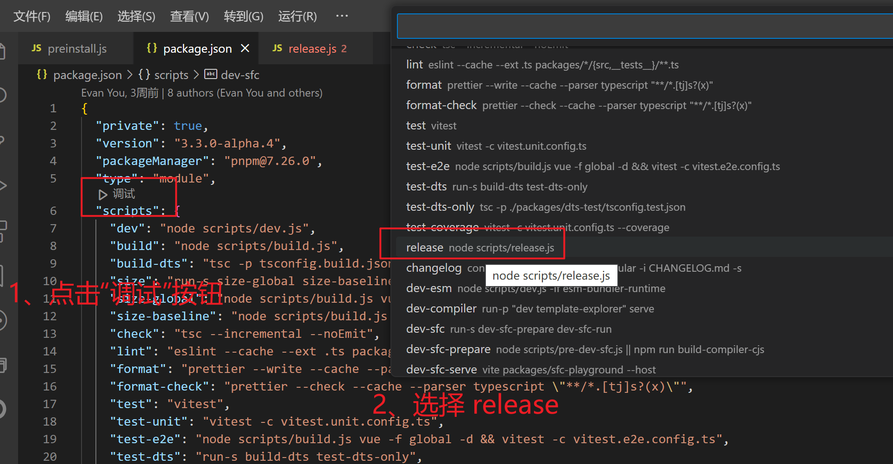
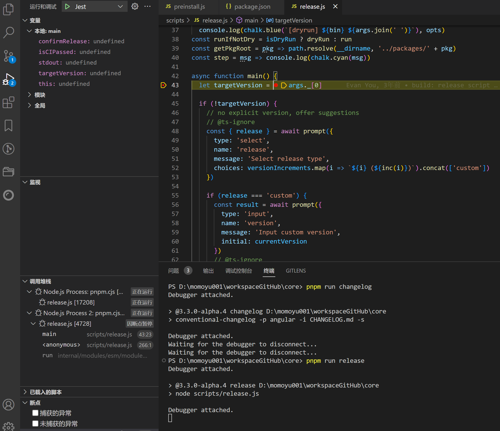
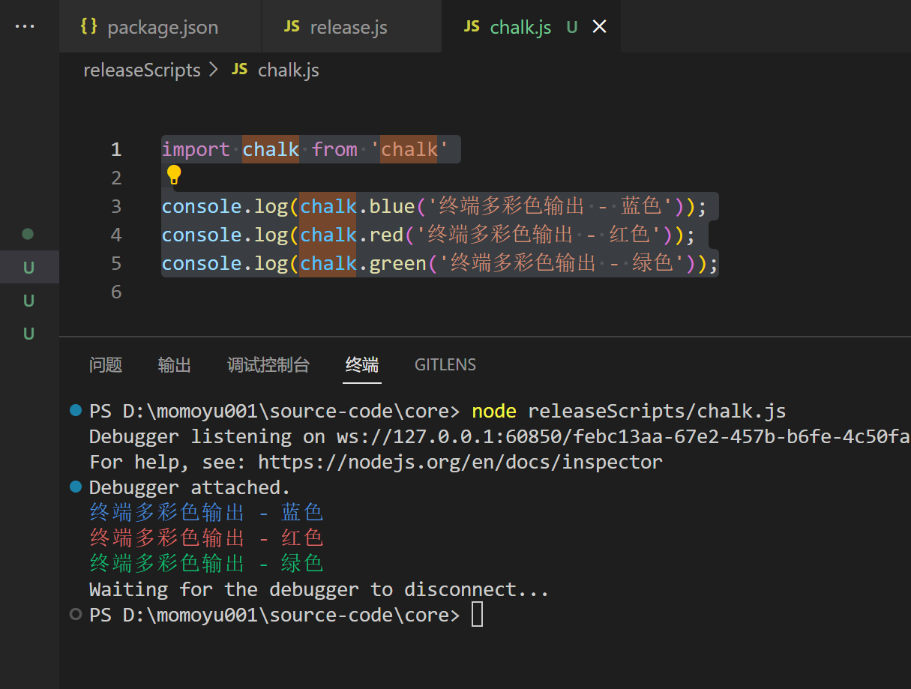
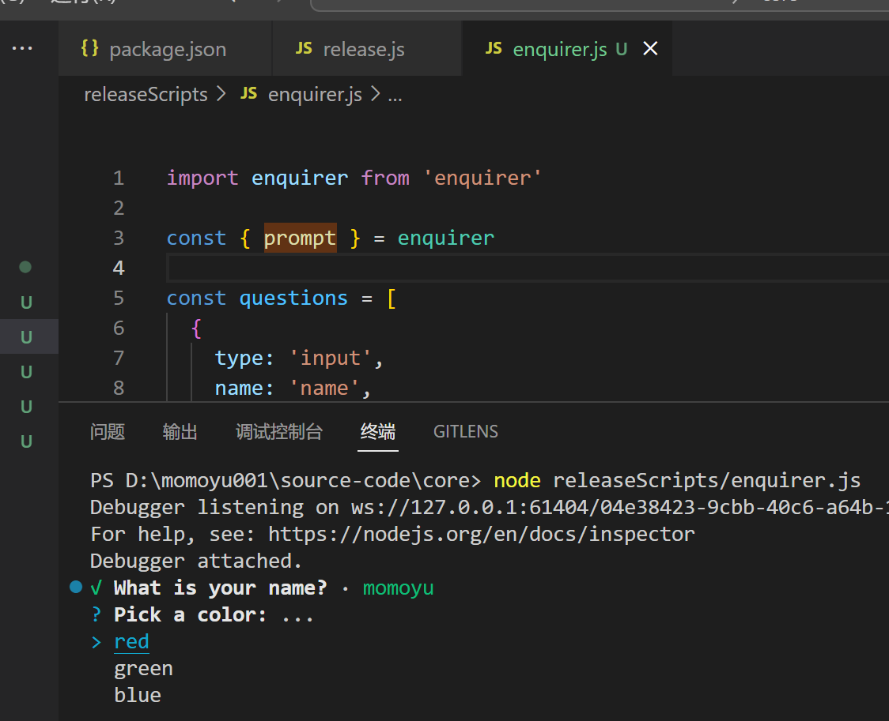
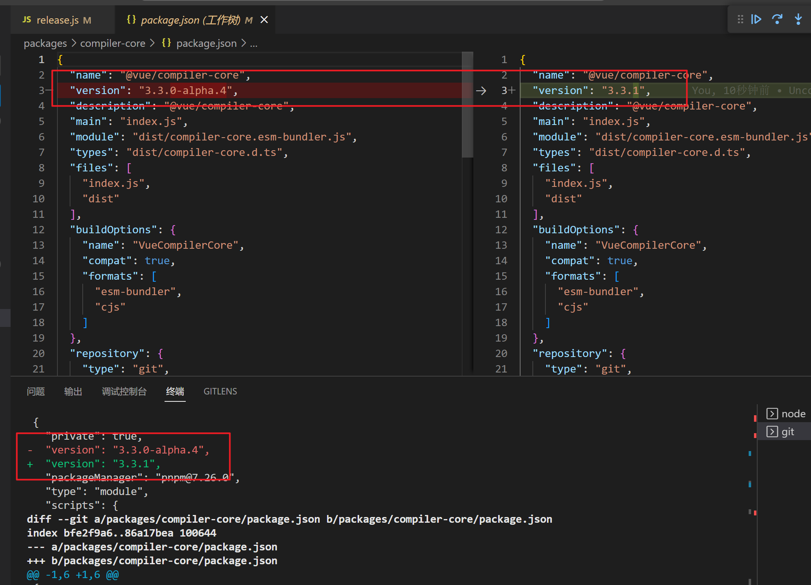
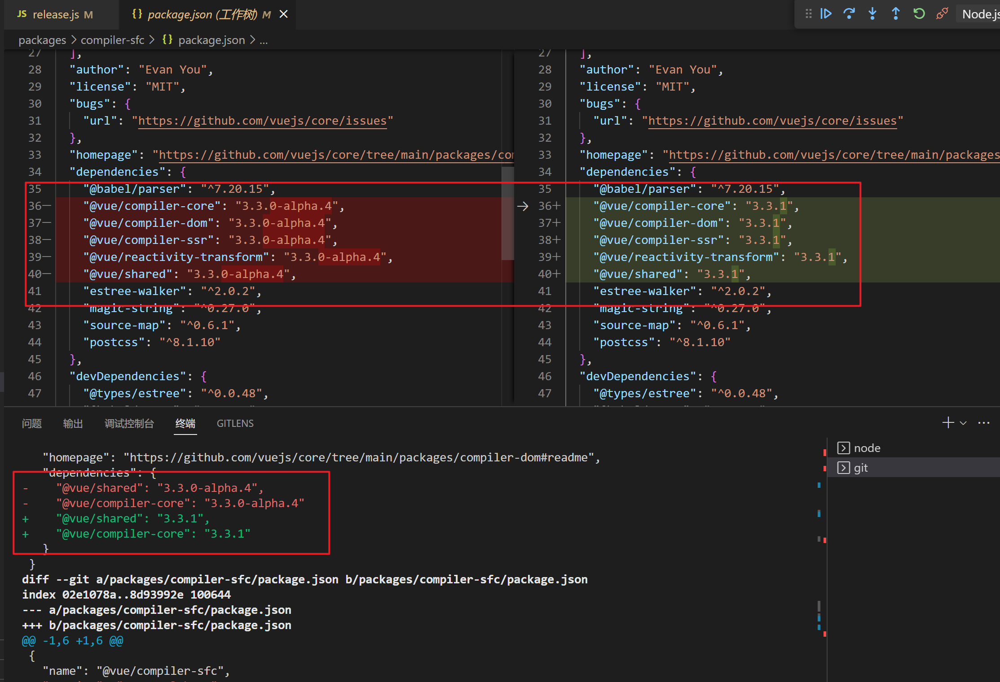
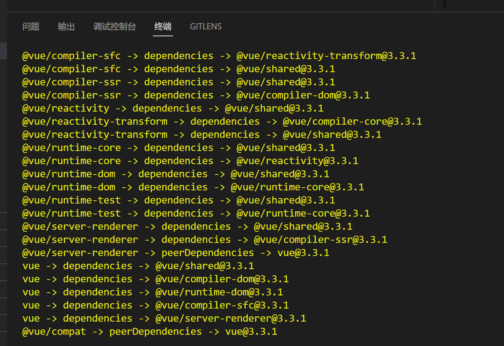
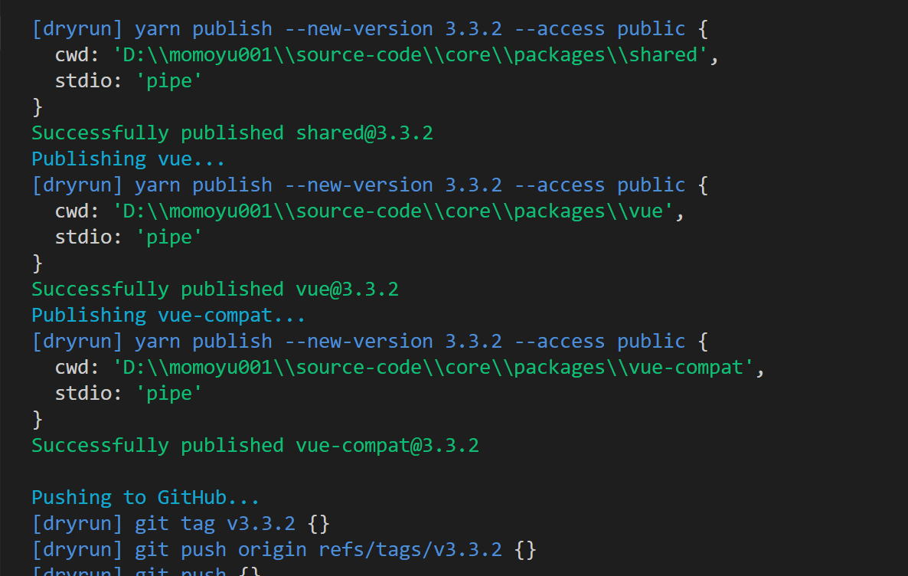
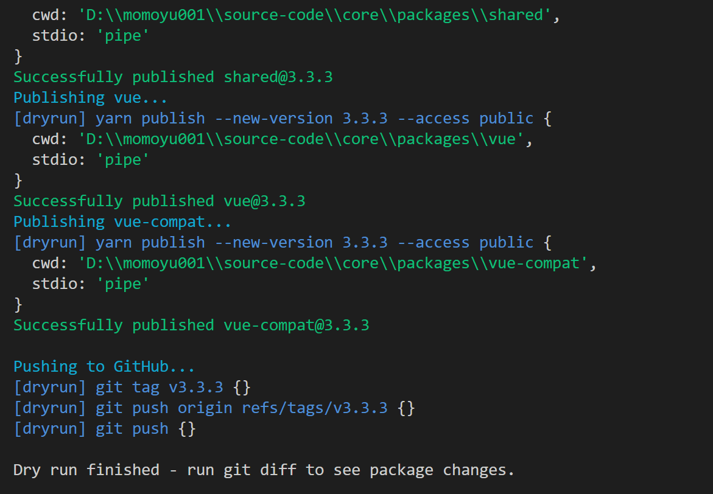
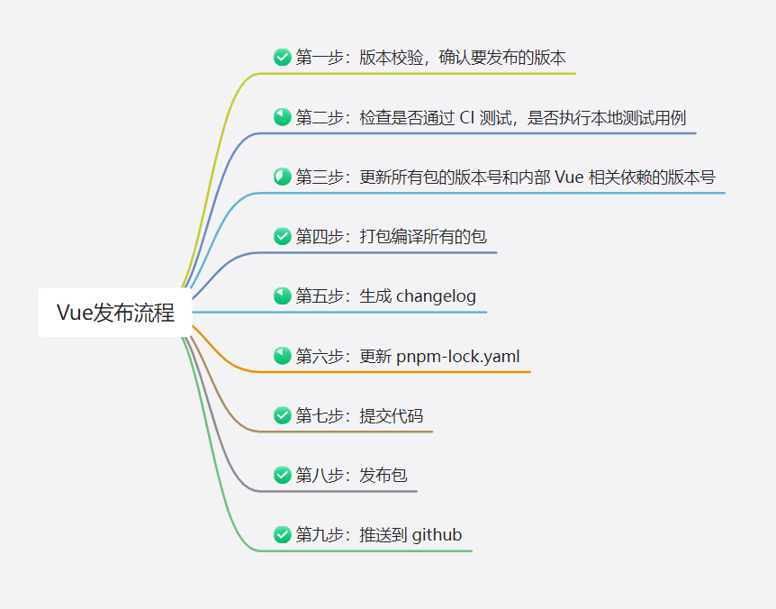

# Vue 是如何发布的

本文基于[Vue 3.2 发布了，那尤雨溪是怎么发布 Vue.js 的？](https://juejin.cn/post/6997943192851054606#heading-27)，按照目前最新的 vue 版本源码来学习纪录。

## 环境准备
克隆项目：[vue/core](https://github.com/vuejs/core)(我克隆的时候，是 3.3.0-alpha.4 版本，要求 node 版本在 16.11.0 及以上，使用 pnpm 作为包管理器)

```
node -v
# 16.11.0

npm install -g pnpm

# 克隆项目
git clone https://github.com/vuejs/core

cd core

# 安装依赖
pnpm i
```
### 强制使用 pnpm
package.json 文件的 scripts 中配置了 `preinstall` 命令，在我们在命令行中执行 `npm install` 时，会先执行`npm preinstall` 。

```json
{
    "scripts": {
        "preinstall": "node ./scripts/preinstall.js"
    }
}
```

再来看指向的 preinstall 文件中的内容，检测了是否是使用 pnpm 进行安装，若不是则会报错。

```js
// @ts-check
if (!/pnpm/.test(process.env.npm_execpath || '')) {
  console.warn(
    `\u001b[33mThis repository requires using pnpm as the package manager ` +
      ` for scripts to work properly.\u001b[39m\n`
  )
  process.exit(1)
}

```

### 调试发布脚本
在 package.json 中可以看到 release 命令，当我们执行 `npm run release` 命令时，实际执行的是 scripts/release.js 文件中的内容。

```json
{
    "scripts": {
        "release": "node scripts/release.js",
    }
}
```

打开 package.json 文件，可以看到 `scripts` 上方有个“调试”按钮。先在 release.js 文件的 main 方法中第一行打一个断电，在 package.json 点击“调试”按钮，选择 release 即可进入调试模式。



这时终端会如下图所示：



[更多 node 调试相关，可以查看官方文档](https://code.visualstudio.com/docs/nodejs/nodejs-debugging)

## release 文件开头的一些依赖引入和函数声明

### 第一部分

```js
// 命令行参数解析
import minimist from 'minimist'
// node 的文件模块
import fs from 'node:fs'
// Node 的路径模块
import path from 'node:path'
// 控制台字体颜色库 - 终端多彩色输出
import chalk from 'chalk'
// 语义化版本库
import semver from 'semver'
// 交互式询问 CLI
import enquirer from 'enquirer'
// 子进程执行库，执行命令
import execa from 'execa'
// 引入动态导入 Node.js 模块的方法
import { createRequire } from 'node:module'
// 引入将文件 URL 转换为文件路径的方法
import { fileURLToPath } from 'node:url'

```
通过依赖，我们可以在 `node_modules` 中找到对应安装的依赖。也可以找到其 `README` 和 `github` 仓库。

#### minimist 命令行参数解析

[minimist](https://github.com/minimistjs/minimist)

简单说，这个库，就是解析命令行参数的。看例子

(我在项目根目录下新建了 releaseScripts 目录，专门存放调试过程可能使用的代码)

```js
// releaseScript/minimist.js
import minimist from 'minimist'

const args = minimist(process.argv.slice(2))

console.log('解析出来的参数：', args);
```

使用 vscode 的 `run code` 命令直接运行 minimist.js 文件，可以看到以下输出：
```
解析出来的参数： { _: [] }

[Done] exited with code=0 in 0.117 seconds
```

当我们在控制台中使用 node 命令加上参数时：

```sh
node releaseScripts/minimist.js -a beep -b boop

# 输出  解析出来的参数： { _: [], a: 'beep', b: 'boop' }

node releaseScripts/minimist.js -x 3 -y 4 -n5 -abc --beep=boop foo bar baz

# 解析出来的参数： {
#   _: [ 'foo', 'bar', 'baz' ],
#   x: 3,
#   y: 4,
#   n: 5,
#   a: true,
#   b: true,
#   c: true,
#   beep: 'boop'
#  }

node releaseScritps/minimist.js 3.2.4
# 输出 解析出来的参数：{ _: ['3.2.4'] }
```

minimist.js 文件中的 `process.argv` 的第一个和第二个元素是 `Node` 可执行文件和被执行 JavaScript 文件的完全限定的文件系统路径，无论你是否这样输入他们。

#### chalk 终端多彩色输出
[chalk](https://github.com/chalk/chalk)

```js
// releaseScripts/chalk.js
import chalk from 'chalk'

console.log(chalk.blue('终端多彩色输出 - 蓝色'));
console.log(chalk.red('终端多彩色输出 - 红色'));
console.log(chalk.green('终端多彩色输出 - 绿色'));
```

在控制台输入 `node releaseScripts/chalk.js` 后可以看到如下效果：



#### semver 语义化版本
[semver](https://github.com/npm/node-semver)

[语义化版本](https://semver.org/lang/zh-CN/)

node-semver 是一个 Node.js 模块，用于解析和比较版本号。

版本号通常采用 x.y.z 的形式，其中 x 表示主版本号、y 表示次版本号、z 表示修订号

```
主版本号：当你做了不兼容的 API 修改，
次版本号：当你做了向下兼容的功能性新增，
修订号：当你做了向下兼容的问题修正。
先行版本号及版本编译信息可以加到“主版本号.次版本号.修订号”的后面，作为延伸。
```

node-semver 可以解析版本号，将其拆分成主版本号、次版本号和修订号等组成部分，并提供一系列 API，用于比较版本号大小、判断版本号是否符合特定的版本范围等。

node-semver 是 Node.js 生态系统中广泛使用的模块之一，它被用于管理 Node.js 和其它相关软件包的版本。

```js
// releaseScrips/semver.js
import semver from 'semver'

// 解析版本号
console.log(semver.parse('1.2.3')); // 输出：{ major: 1, minor: 2, patch: 3, ... }

// 比较版本号
console.log(semver.gt('1.2.3', '1.2.2')); // 输出：true - 大于
console.log(semver.lt('1.2.3', '1.2.4')); // 输出：true - 小于
console.log(semver.eq('1.2.3', '1.2.3')); // 输出：true - 等于

// 判断版本号是否符合范围要求
console.log(semver.satisfies('1.2.3', '>=1.0.0 <2.0.0')); // 输出：true
console.log(semver.satisfies('2.0.0', '>=1.0.0 <2.0.0')); // 输出：false

// 获取当前传入的版本的预发布标识
console.log('1：', semver.prerelease('3.3.0-alpha.4')); // 输出：[ 'alpha', 4 ]
console.log('2：', semver.prerelease('3.3.0-alpha.4')?.[0]) // 输出：alpha

// 校验当前传入的版本号是否符合语义化版本规范
semver.valid('1.2.3') // 1.2.3
```

在控制台输入 `node releaseScripts/semver.js` 并运行可以看到相应的结果。

`semver.parse` 方法用于解析版本号，返回一个包含版本号各组成部分的对象。

`semver.gt`、`semver.lt` 和 `semver.eq` 方法用于比较两个版本号的大小，返回布尔值。

`semver.satisfies` 方法用于判断一个版本号是否符合指定的版本范围，返回布尔值。

`semver.prerelease` 方法用于返回当前版本号中的预发布标识。

`semver.valid` 方法用于判断当前传入的版本号是否符合语义化版本规范。符合语义规范则返回版本号，不符合则返回 null。

#### enquirer 交互式询问 CLI
[enquirer](https://github.com/enquirer/enquirer)

Enquirer 是一个 Node.js 模块，用于构建交互式命令行界面（CLI）应用程序。它提供了一组易于使用的 API，使得开发者可以快速地构建出各种各样的命令行界面，包括问答式交互、复选框选择、单选框选择、表单输入等。

```js
// releaseScripts/enquirer.js
import enquirer from 'enquirer'

const { prompt } = enquirer

const questions = [
  {
    type: 'input',
    name: 'name',
    message: 'What is your name?'
  },
  {
    type: 'select',
    name: 'color',
    message: 'Pick a color:',
    choices: ['red', 'green', 'blue']
  }
]

prompt(questions)
  .then(answers => console.log('Answers:', answers))
  .catch(console.error)

```

控制台运行 `node releaseScripts/enquirer.js` 可看到如下界面：



最后会打印出 Answers：

```
Answers: { name: 'momoyu', color: 'blue' }
```

#### execa 执行命令

[execa](https://github.com/sindresorhus/execa)

execa 是一个用于执行外部命令的 JavaScript 库。它可以在 Node.js 环境下运行，并且可以跨平台地执行命令。execa 模块提供了一种简单的方式来执行命令，并且支持异步操作和 Promise 接口。与 Node.js 内置的 child_process 模块相比，execa 的 API 更加简单易用，并且提供了更多的特性，例如可以方便地传递命令参数和选项，支持流传输数据等等。

execa 库的主要用途是在 Node.js 应用程序中执行外部命令，例如在脚本中自动化执行系统命令，或者在构建工具中执行 shell 命令等等。由于 execa 支持 Promise 接口，因此可以方便地在异步操作中使用，并且可以处理命令的输出和错误，以便更好地控制应用程序的流程。

简单来说就是执行命令的，类似我们自己在终端输入命令。

execa 函数的第一个参数是要执行的命令，可以是一个字符串或一个数组。如果是一个字符串，则会被解析成一个命令和参数的数组。

execa 函数的第二个参数是一个选项对象，可以设置命令的执行环境、超时时间等等。

execa 函数返回一个 Promise 对象，可以通过 then 方法获取命令的输出和错误信息。

```js
// releaseScrips/execa.js
import execa from 'execa'

execa('git', ['--version'])
  .then(result => {
    console.log(result.stdout)
  })
  .catch(error => {
    console.error(error)
  })
```

控制台运行 `node releaseScrips/execa.js` 可以看到输出：`git version 2.29.2.windows.3`。

与我们直接在控制台输入 `git --version` 的返回值一致。

### 第二部分

主要用于获取当前模块的 package.json 中的 version 字段值以及解析脚本的命令行参数，并引入了一些需要的依赖库，以便在后面的代码中使用。

```js
const { prompt } = enquirer // 获取命令行交互库中的 prompt 方法

const currentVersion = createRequire(import.meta.url)('../package.json').version // 通过动态导入获取当前 package.json 中的 version 字段值

const __dirname = path.dirname(fileURLToPath(import.meta.url)) // 获取当前脚本所在目录的绝对路径

const args = minimist(process.argv.slice(2)) // 解析脚本的命令行参数

// 首先判断执行 npm run release 时有没有直接带入 preId 参数；其次从当前 package.json 的 version 字段中获取标识符（semver 模块的 prerelease 方法可以从给定的版本号中获取预发布标识符）
const preId = args.preid || semver.prerelease(currentVersion)?.[0] // 获取预发布版本的标识符，如果没有则返回 undefined

// pnpm run release --dry
const isDryRun = args.dry // 是否为空运行模式，即只输出操作日志而不实际执行操作

// pnpm run release --skipTests
let skipTests = args.skipTests // 是否跳过测试

// pnpm run release --skipBuild
const skipBuild = args.skipBuild // 是否跳过构建

const packages = fs
  .readdirSync(path.resolve(__dirname, '../packages'))
  .filter(p => !p.endsWith('.ts') && !p.startsWith('.')) // 获取 packages 目录下的所有子目录（即所有包的目录），过滤掉不是 .ts 结尾的文件，并且不是 . 开头的文件夹

```

### 第三部分
用于生成新版本的版本号。

```js
const skippedPackages = [] // 定义在发布过程中跳过的包名

/**
 * 定义可能的版本更新类型 - 版本递增
 * 
 * patch - 修复 bug
 * minor - 增加功能但是向下兼容
 * major - 不向下兼容的重大变更
 * prepatch、preminor、premajor、prerelease - 用于预发布版本的标识符
 * **/
const versionIncrements = [
  'patch',
  'minor',
  'major',
  ...(preId ? ['prepatch', 'preminor', 'premajor', 'prerelease'] : []) // preId 存在则表示需要发布预发布版本
]
```

例如：如果执行命令 `npm run release -- --release-as patch` ，则会将版本号更新为当前版本的小修订版本（即 patch）；如果执行命令 `node releaseScripts/minimist.js -- --release-as preminor --preid beta` ，则会将版本号更新为下一个次要版本号的预发布版本号（即，preminor），并将预发布版本的标识符置为 beta

```sh
node releaseScripts/minimist.js -- --release-as patch
# 控制台输出： { _: ['--release-as', 'patch'] }

node releaseScripts/minimist.js --release-as patch
# 控制台输出：{ _: [], 'release-as': 'patch' }

node releaseScripts/minimist.js -- --release-as preminor --preid beta
# 控制台输出：{ _: [ '--release-as', 'preminor', '--preid', 'beta' ] }

node releaseScripts/minimist.js --release-as preminor --preid beta
# 控制台输出：{ _: [], 'release-as': 'preminor', preid: 'beta' }
```

### 第四部分

```js
/**
 * 定义一个函数，用于根据传入的 i 对版本号进行自增操作。
 * semver.inc 是一个用于语义化版本控制的第三方库的方法
 * 
 * semver.inc('3.3.0-alpha.4', 'prerelease', 'alpha') 输出 3.3.0-alpha.5
 * **/
const inc = i => semver.inc(currentVersion, i, preId) // 

/**
 * 用于执行指定的命令行程序，真实在终端跑命令
 * 
 * bin 表示程序名
 * args 表示参数列表
 * opts 表示附加的选项
 * 
 * 使用了第三方库 execa 来执行命令行程序
 * **/
const run = (bin, args, opts = {}) =>
  execa(bin, args, { stdio: 'inherit', ...opts })

/**
 * 用于输出模拟运行的命令行程序信息，不会真正执行程序，只是在控制台输出日志
 * 使用了 chalk 库来改变控制台输出时的文字颜色
 * **/
const dryRun = (bin, args, opts = {}) =>
  console.log(chalk.blue(`[dryrun] ${bin} ${args.join(' ')}`), opts)

/**
 * 用于判断是否处于模拟运行模式，如果是，则使用 dryRun 方法，否则使用 run 方法
 * **/
const runIfNotDry = isDryRun ? dryRun : run

/**
 * 用于根据包名获取包的根目录路径
 * **/
const getPkgRoot = pkg => path.resolve(__dirname, '../packages/' + pkg)

/**
 * 用于输出当前执行的步骤信息
 * **/
const step = msg => console.log(chalk.cyan(msg))

```

## main 主流程

```js
async function main() {
  // 校验、确认版本号

  // 检查当前 Git 仓库的 最新提交记录是否通过了 CI 测试
  step('Checking CI status for HEAD...')

  // 执行测试用例
  step('\nRunning tests...')
  // or 跳过测试用例
  step('Tests skipped.')

  // 更新所有包的版本号（代码库中所有依赖其他代码库的依赖项）
  step('\nUpdating cross dependencies...')

  // 构建所有的包
  step('\nBuilding all packages...')

  // 生成 Vue3 代码库的变更日志
  step('\nGenerating changelog...')

  // 更新锁定文件已匹配项目中使用的确切版本的依赖项
  step('\nUpdating lockfile...')

  // 将代码库的更改提交到 Git 仓库中
  step('\nCommitting changes...')

  // 将更新后的代码库提交到 npm 或其他包管理器上
  step('\nPublishing packages...')

  // 将本地 Git 仓库中的修改推送到远程仓库中
  step('\nPushing to GitHub...')

}
```
### 第一步 - 版本校验，确认要发布的版本
```js
async function main() {
  //获取版本号 - targetVersion。若运行 npm run release 3.3.1 ,则可获取到 3.3.1
  let targetVersion = args._[0]

  if (!targetVersion) {
    // no explicit version, offer suggestions
    // 若没有明确的指定版本号，提供交互式界面供用户选择
    const { release } = await prompt({
      type: 'select',
      name: 'release',
      message: 'Select release type',
      // 可选项中使用 inc 方法来递增了一个版本
      choices: versionIncrements.map(i => `${i} (${inc(i)})`).concat(['custom'])
    })

    // 自定义版本号
    if (release === 'custom') {
      const result = await prompt({
        type: 'input',
        name: 'version',
        message: 'Input custom version',
        initial: currentVersion // 给用户提供的一个默认值
      })
      // @ts-ignore
      targetVersion = result.version
    } else {
      // 获取到括号中的版本号
      targetVersion = release.match(/\((.*)\)/)[1]
    }
  }

  // 验证版本号是否符合语义化版本规范
  if (!semver.valid(targetVersion)) {
    throw new Error(`invalid target version: ${targetVersion}`)
  }

  // 再次确认要发布的版本号
  const { yes: confirmRelease } = await prompt({
    type: 'confirm',
    name: 'yes',
    message: `Releasing v${targetVersion}. Confirm?`
  })

  // false 则直接返回
  if (!confirmRelease) {
    return
  }
}
```

main 函数中，首先或获取命令行参数，若没有在命令行参数中指定版本，会有 enquirer 提供交互式的控制台界面供用户选择或自定义版本号。

有了版本号之后，会使用 semver 的 valid 方法校验当前版本号是否符合语义化规范。不符合规范则抛出错误，符合规范后会再次确认版本号，确认之后继续后面的步骤。

### 第二步 - 检查是否通过 CI 测试，是否执行本地测试用例
这段代码的主要作用是确保在发布新版本之前，CI 已经通过，并且构建状态良好，这可以防止发布有问题的代码版本，并帮助确保发布版本的稳定性和可靠性。

```js
step('Checking CI status for HEAD...')
let isCIPassed = true
try {
  // 使用 execa 执行 git rev-parse HEAD 命令，获取当前Git仓库的最新提交 SHA
  const { stdout: sha } = await execa('git', ['rev-parse', 'HEAD'])
  // 使用 fetch 函数访问 GitHub API ,获取与该 SHA 相关的所有 GitHub Actions 运行的状态信息
  const res = await fetch(
    `https://api.github.com/repos/vuejs/core/actions/runs?head_sha=${sha}` +
      `&status=success&exclude_pull_requests=true`
  )
  // 解析 API 返回的 JSON 数据
  const data = await res.json()

  // 如果存在任何一次运行成功，则认为 CI 已经通过，否则认为没有通过
  isCIPassed = data.workflow_runs.length > 0
} catch (e) {
  // 如果出现任何错误，则认为 CI 没有通过
  isCIPassed = false
}

// CI 测试通过，是否跳过本地测试
if (isCIPassed) {
  // @ts-ignore
  const { yes: promptSkipTests } = await prompt({
    type: 'confirm',
    name: 'yes',
    message: `CI for this commit passed. Skip local tests?`
  })
  if (promptSkipTests) {
    skipTests = true
  }
}

// 如果 CI 没有通过，需要执行本地的测试用例
if (!skipTests) {
  step('\nRunning tests...')
  if (!isDryRun) {
    // 如果是真实运行（非空运行），则执行 pnpm test run 命令
    await run('pnpm', ['test', 'run'])
  } else {
    // 空运行则只打印出日志即可
    console.log(`Skipped (dry run)`)
  }
} else {
  step('Tests skipped.')
}

```

这一部分的代码，首先使用 execa 库执行了 `git rev-parse HEAD` 命令，该命令用于获取当前代码库最新的提交记录的 SHA-1 校验和。

`rev-parse` 表示解析 Git 对象名的命令

`HEAD` 表示要解析的 Git 对象名，这里指的是当前所在分支的最新提交记录。

```js
import execa from 'execa'

execa('git', ['rev-parse', 'HEAD']).then(res => {
  console.log('执行结果。。。。', res)
})

// 输出：
// 执行结果。。。。 {
//   command: 'git rev-parse HEAD',
//   exitCode: 0,
//   stdout: '98f1934811d8c8774cd01d18fa36ea3ec68a0a54',
//   stderr: '',
//   all: undefined,
//   failed: false,
//   timedOut: false,
//   isCanceled: false,
//   killed: false
// }
```

其次调用 API 查询该 SHA 相关的 GitHub Actions ，若 CI 通过，则可不用在本地执行测试用例，若 CI 没有通过，则需要在本地执行测试用例（`pnpm test run`），测试用例通过才可以执行后续程序。

### 第三步 - 更新所有包的版本号和内部 Vue 相关依赖的版本号

这部分代码的作用是更新所有 Vue3 源码包的版本号，确保他们都使用相同的版本号。

```js
// update all package versions and inter-dependencies
step('\nUpdating cross dependencies...')
updateVersions(targetVersion)
```
#### updateVersions 方法
定义 updateVersions 方法，用于批量更新所有包的版本号。

```js
function updateVersions(version) {
  // 1. update root package.json
  updatePackage(path.resolve(__dirname, '..'), version)
  // 2. update all packages
  packages.forEach(p => updatePackage(getPkgRoot(p), version))
}
```

#### updatePackage 方法
定义 updatePackage 方法，用于更新一个包的版本号及其依赖的版本号。

自身 package.json 中 version 字段的修改。

package.json 中 dependencies 中 vue 相关依赖的修改。

package.json 中 peerDependencies 中 vue 相关依赖的修改。

```js
function updatePackage(pkgRoot, version) {
  // 获取当前包的 package.json 文件路径
  const pkgPath = path.resolve(pkgRoot, 'package.json')
  // 读取当前包的 package.json 文件
  const pkg = JSON.parse(fs.readFileSync(pkgPath, 'utf-8'))
  // 更新当前包的版本号为指定的 version
  pkg.version = version
  // 更新当前包的 dependencies 和 peerDependencies 字段中的 vue 相关依赖版本为指定的 version
  updateDeps(pkg, 'dependencies', version)
  updateDeps(pkg, 'peerDependencies', version)
  // 将更新后的 package.json 文件写入磁盘
  fs.writeFileSync(pkgPath, JSON.stringify(pkg, null, 2) + '\n')
}
```
执行 `pnpm release --dry` 命令之后，可以看到版本号都已经被更改




#### updateDeps 方法
定义 updateDeps 方法，用于更新一个包的依赖的版本号。

```js
function updateDeps(pkg, depType, version) {
  const deps = pkg[depType]
  // 如果当前包没有指定类型的依赖，则直接返回
  if (!deps) return
  // 遍历当前包的依赖列表
  Object.keys(deps).forEach(dep => {
    // 如果依赖为 workspace:* 则直接返回
    if (deps[dep] === 'workspace:*') {
      return
    }

    // 如果依赖为 Vue 相关依赖，则将其版本号更新为指定的 version
    if (
      dep === 'vue' ||
      (dep.startsWith('@vue') && packages.includes(dep.replace(/^@vue\//, '')))
    ) {
      console.log(
        chalk.yellow(`${pkg.name} -> ${depType} -> ${dep}@${version}`)
      )
      deps[dep] = version
    }
  })
}

```

执行 `pnpm release --dry` 命令之后，可以看到 packages 目录下的各个包中 package.json 中的 dependencies 、 peerDependencies 的依赖版本号也已修改






### 第四步 - 打包编译所有的包

```js
// build all packages with types
step('\nBuilding all packages...')
if (!skipBuild && !isDryRun) {
  // pnpm build 命令来构建所有包
  await run('pnpm', ['run', 'build'])
  step('\nBuilding and testing types...')
  // pnpm test-dts 命令来构建和测试类型声明文件
  await run('pnpm', ['test-dts'])
} else {
  console.log(`(skipped)`)
}

```

### 第五步 - 生成 changelog

即，执行 `pnpm run changelog`。可以在 package.json 中看到具体的脚本 `conventional-changelog -p angular -i CHANGELOG.md -s`

```js
// generate changelog
step('\nGenerating changelog...')
await run(`pnpm`, ['run', 'changelog'])
```

### 第六步 - 更新 pnpm-lock.yaml

即，执行 `pnpm install --prefer-offline` 命令更新 pnpm-lock.yaml 文件。

```js
// update pnpm-lock.yaml
step('\nUpdating lockfile...')
await run(`pnpm`, ['install', '--prefer-offline'])
```

### 第七步 - 提交代码

首先执行 `git diff` 命令，`{ stdio: 'pipe' }` 指定标准输入输出流的传输方式为流水线传输。

```js
const { stdout } = await run('git', ['diff'], { stdio: 'pipe' })
if (stdout) {
  // 如果有差异，执行 git add -A，git commit -m 'release: 版本号' 
  step('\nCommitting changes...')
  await runIfNotDry('git', ['add', '-A'])
  await runIfNotDry('git', ['commit', '-m', `release: v${targetVersion}`])
} else {
  console.log('No changes to commit.')
}
```

### 第八步 - 发布包

```js
// publish packages
step('\nPublishing packages...')
for (const pkg of packages) {
  await publishPackage(pkg, targetVersion, runIfNotDry)
}
```

#### publishPackage 方法

该方法将某个指定的包发布到 npm 上。函数内部会读取该包的 package.json 的内容，检查该包是否为私有包，如果是则不会进行发布。

```js
async function publishPackage(pkgName, version, runIfNotDry) {
  if (skippedPackages.includes(pkgName)) {
    return
  }
  const pkgRoot = getPkgRoot(pkgName)
  const pkgPath = path.resolve(pkgRoot, 'package.json')
  const pkg = JSON.parse(fs.readFileSync(pkgPath, 'utf-8'))
  // 如果是私有包就不会进行发布
  if (pkg.private) {
    return
  }

  // 判断发布的标签类型 - releaseTag
  let releaseTag = null
  if (args.tag) {
    releaseTag = args.tag
  } else if (version.includes('alpha')) {
    releaseTag = 'alpha'
  } else if (version.includes('beta')) {
    releaseTag = 'beta'
  } else if (version.includes('rc')) {
    releaseTag = 'rc'
  }

  step(`Publishing ${pkgName}...`)
  try {
    // 这里发布的时候，使用的是 yarn publish 命令
    await runIfNotDry(
      // note: use of yarn is intentional here as we rely on its publishing
      // behavior.
      'yarn',
      [
        'publish',
        '--new-version',
        version,
        ...(releaseTag ? ['--tag', releaseTag] : []),
        '--access',
        'public'
      ],
      {
        cwd: pkgRoot,
        stdio: 'pipe'
      }
    )
    console.log(chalk.green(`Successfully published ${pkgName}@${version}`))
  } catch (e) {
    if (e.stderr.match(/previously published/)) {
      console.log(chalk.red(`Skipping already published: ${pkgName}`))
    } else {
      throw e
    }
  }
}

```

在控制台执行 `pnpm release --dry --skipTests` 后，可在控制台看到如下输出：



为什么要使用 `yarn publish` ？`yarn publish` 命令具有以下好处：

- 能够自动解决依赖关系并创建一个干净的发布版本。
- 可以在一次提交中完成发布的所有步骤，而不是像使用npm时那样需要多次命令。
- 可以自定义tag，以便在发布alpha，beta和rc版本时更轻松地管理版本号。
- yarn发布支持访问控制，可以将发布限制为私有或公共。
- 在一些特殊情况下，使用yarn发布可能比使用npm更可靠，因为yarn的发布逻辑在某些方面与npm不同，例如yarn会自动发布git标签。

### 第九步 - 推送到 GitHub

```js
// push to GitHub
step('\nPushing to GitHub...')
// 打 tag `git tag v${yatgetVersion}`
await runIfNotDry('git', ['tag', `v${targetVersion}`])
// 推送 tag `git push origin refs/tags/v${targetVersion}`
await runIfNotDry('git', ['push', 'origin', `refs/tags/v${targetVersion}`])
// 推送到远端 git push
await runIfNotDry('git', ['push'])

if (isDryRun) {
  console.log(`\nDry run finished - run git diff to see package changes.`)
}

if (skippedPackages.length) {
  console.log(
    chalk.yellow(
      `The following packages are skipped and NOT published:\n- ${skippedPackages.join(
        '\n- '
      )}`
    )
  )
}
console.log()
```

最后我们在控制台看到一下输出,，本次版本发布即完成。



## 总结
总结一下 Vue 的发布流程：


